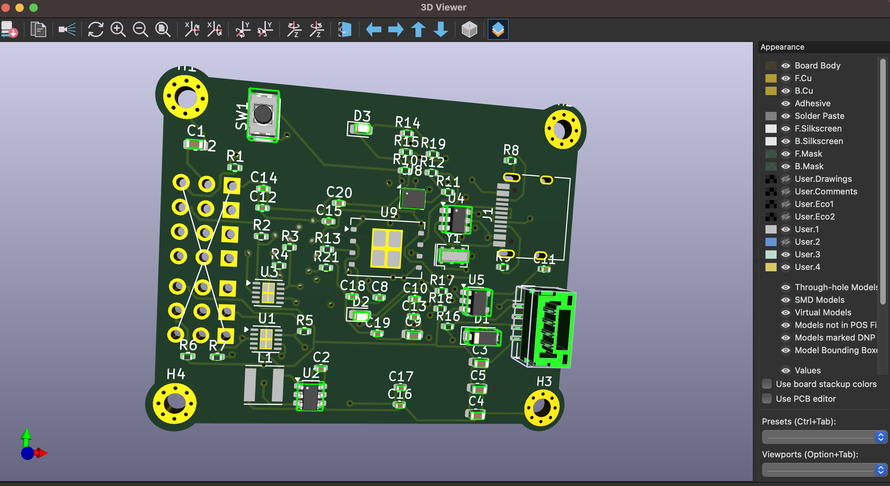
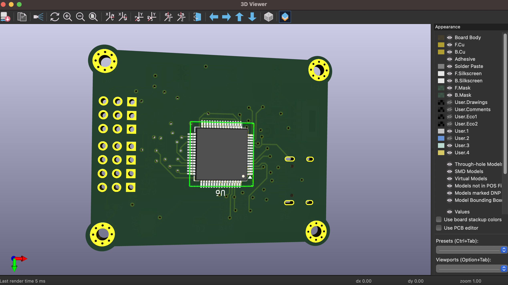

# fun-flight
This is my flight controller fun flight which is STM37F722 based Fc

## Features
- STM32F405RGT6 (168 MHz, 1 MB Flash)
- 8 × PWM servo outputs (JST-SM)
- MPU-9250 / ICM-42688 ready (I2C + SPI)
- W25Q128 16 MB flash for blackbox
- USB-C (DFU + serial)
- 5 V buck + 3.3 V LDO (7–20 V input)

  
## PCB Renders

### Front Layer

### Bottom Layer

  
