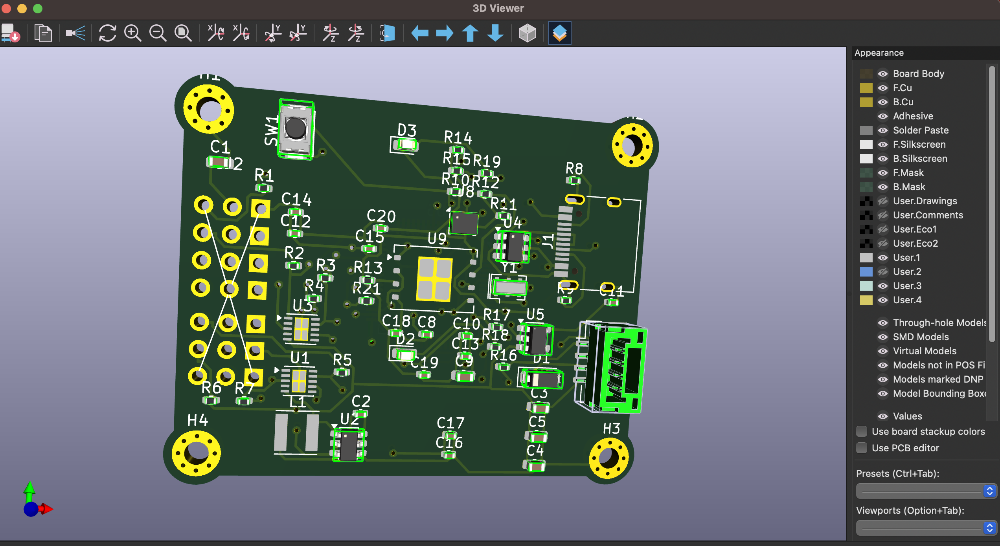
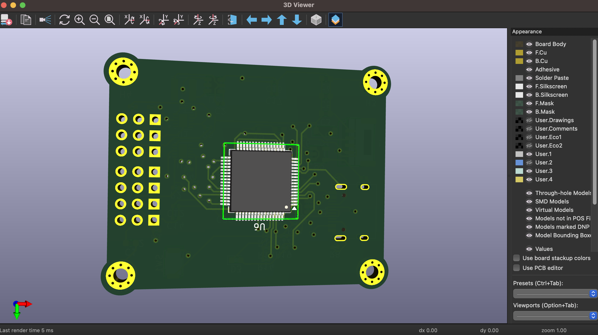

# fun-flight
Fun Flight – Custom Flight Controller which is a STM37F722 based Fc which is leaned more towards planes and can be used for the drone too with a pwm escs.

the whole motivation behind building was that i was really motivated in making planes but all the plane flight controllers are really expensive for my hobby use case and while when it comes to fun flight its hobby grade great for anyone who doesnt want all the complicated gps and stuff in their plane and this can coustomized as they like as its completely open soucred by me ;)

## Key Features
- STM32F405RGT6 (168 MHz, 1 MB Flash) 
- 8 × PWM servo outputs which can be mapped for motor outputs too
- MPU-9250
- ICM-42688 (I2C + SPI)
- W25Q128 for a extra 16mb of data for the black box and the flash for trobuleshooting and everything
- USB-C (DFU + serial)
- 5 V buck + 3.3 V LDO (upto to 3s input)

  
## PCB 

### Front Layer

### Bottom Layer

  
